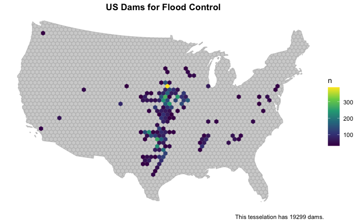

In the summer of 2021, I took a spatial data science course based in R. It introduced me to programming and how to write code. Here is a collection of links showcasing what I learned!

## [Building a project website]()

- In this assignment, I built a static user site with Github Pages.
- The code and files for this site are stored and organized in a Github repository.
- Toolkits, such as Bootstrap, enable navigation by redirecting one from the home page to other pages via the navbar.
- I used [Bootswatch](https://bootswatch.com/3/) to add a theme to my website.

## [Data Wrangling: COVID-19 Pandemic](https://laurenwhightsil.github.io/geog-13-labs/lab-02.html)

- I used New York Times COVID-19 Data and USDA Population Data to analyze cases of the virus
across U.S. counties, working primarily with daily new cases, total case counts, state rolling 7-day mean cases, and cases per capita.
- I wrote programmatic requests to enable the data to update with daily additions made to the url of supporting COVID-19 data.
- I mapped the migration of the weighted mean coordinate locations of COVID-19 cases through time, scaling the mean center points with nationwide cumulative cases in relation to the current case counts.

{width=90%}

## [Distances and Projections](https://laurenwhightsil.github.io/geog-13-labs/lab-03.html)

- I worked with spatial (sf) objects and coordinate systems and converted from MULTIPOLYGON to MULTILINESTRING geometries, in order to visualize country and state borders.
- I wrote functions to hasten coding that involved repeated use of the same code.
- I learned to use gghighlight to show only the pertaining data in color and lty to create dashed boundaries.

{width=70%}

## [Tessellations and Point-in-Polygon Analyses of Dams in the US ](https://laurenwhightsil.github.io/geog-13-labs/lab-04.html)

- I created tessellated surfaces of US county centroids and grid coverages intersected to the boundaries of the contiguous United States.
- Using data from the US Army Corp of Engineers' National Dam Inventory (NID), I mapped the spatial distribution of dams in the tessellations, noting that tile size can be deceptive (see: [The Modifiable Areal Unit Problem (MAUP)](https://www.gislounge.com/modifiable-areal-unit-problem-gis/))
- I created point-in-polygon visualizations for dams of specific purposes, such as recreation and flood control.

{width=70%}

